# awesome-ethereum-diagrams

"A picture tells a thousand words." A curated list of useful diagrams with links to original sources. Diagrams help me grasp complex ethereum concepts related to L1, L2, and Defi.  Contributions and feedback are welcome.

- [L1](#l1)
- [L2](#l2)
- [Oracles](#oracles)
- [Frameworks](#frameworks)
- [DeFi and DAO tekenomics](#defi-and-dao-tokenomics)
- [Governance](#governance)
- [NFT platforms](#nft-platforms)
- [Other blockchain technologies](#other-blockchain-technologies)

## L1

| Diagram                                                | Source        |       
| -------                                                | ------        | 
|         | [Merkle Patricia Trie in Ethereum](https://kbaiiitmk.medium.com/merkle-patricia-trie-in-ethereum-a-silhouette-c8d04155b490) - every block header stores roots of three trie structures: stateRoot, transactionRoot, receiptsRoot | 
|         | [The Scalability Trilemma](https://vitalik.ca/general/2021/04/07/sharding.html) |
|         | [Ethereum roadmap: merge, surge, verge, purge, splurge](https://twitter.com/VitalikButerin/status/1466411377107558402?s=20&t=IkX3s2xEMU0K9EVJVZLotg) |
|         | [Ethereum proof of work chain](https://notes.ethereum.org/@vbuterin/SkeyEI3xv) |
|         | [Ethereum sharding](https://notes.ethereum.org/@vbuterin/SkeyEI3xv) |
|         | [Casper FFG in Ethereum 2.0](https://link.medium.com/gbH9gatWvnb) |
| 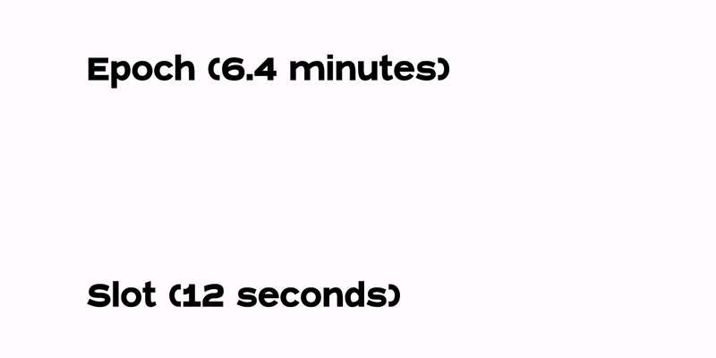        | [Epochs and slots in Ethereum 2.0](https://medium.com/stakefish/deeper-dive-into-ethereum-2-0-part-1-93c475a18735) |
| 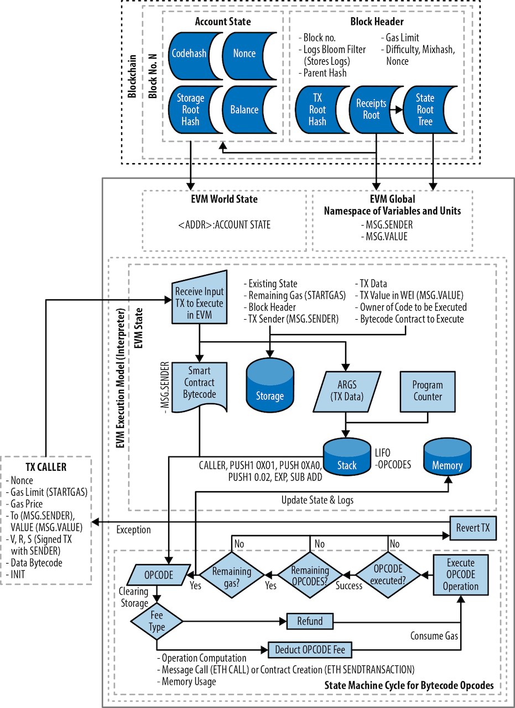        | [Ethereum EVM architecture](https://github.com/ethereumbook/ethereumbook/blob/develop/13evm.asciidoc) |
| 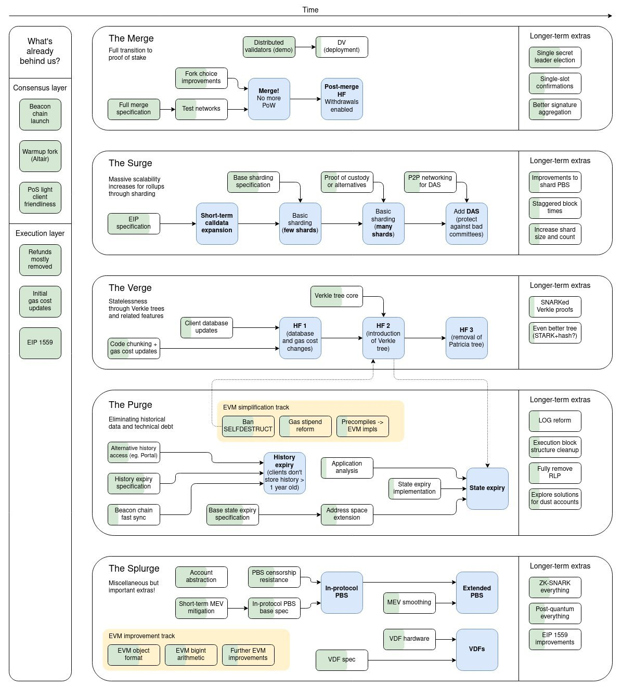        | [Ethereum roadmap status as of 3/15/2022](https://twitter.com/pseudotheos/status/1503370385890324484) |
| 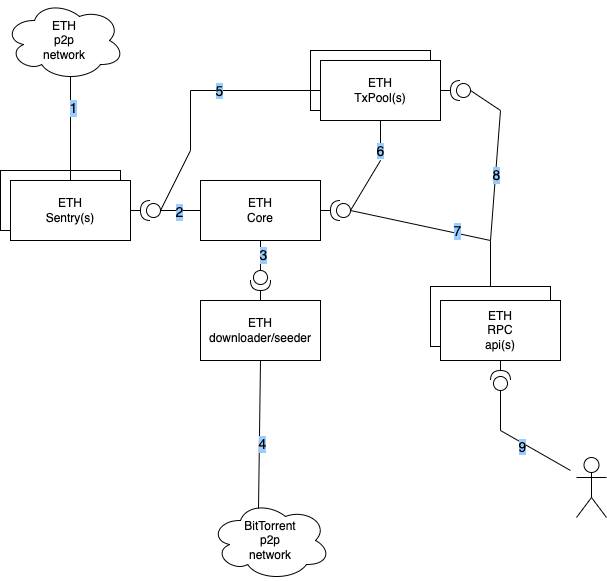        | [The erigon ethereum client](https://erigon.substack.com/p/architecture-of-erigon-separable?s=r) |
| 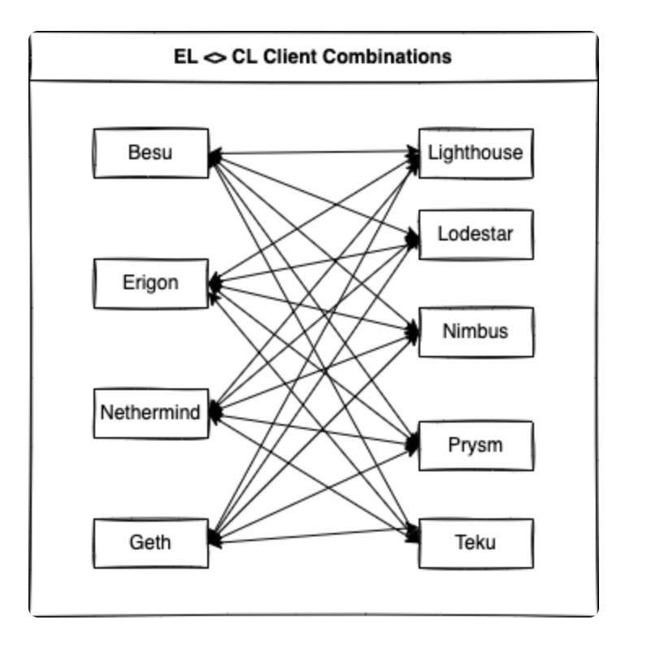        | [Execution/Concencus client pairs](https://hackmd.io/@timbeiko/acd/https%3A%2F%2Ftim.mirror.xyz%2FPWFVaHY3Mrx7srarMmuBWya0J5kioR1l2xaH3p5APDk%3Fdisplay%3Diframe) |
| 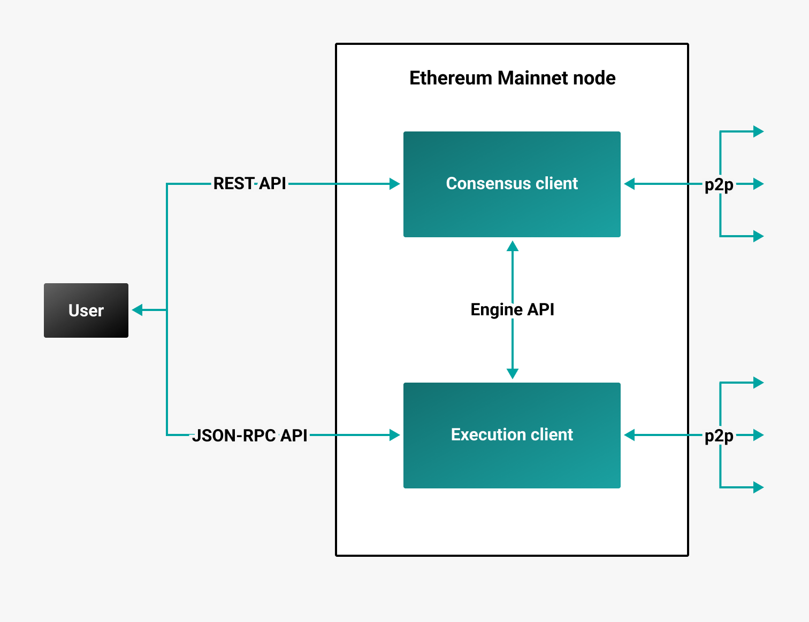        | [POS Execution/Concencus layer interop](https://besu.hyperledger.org/en/stable/Concepts/Merge/) |
| 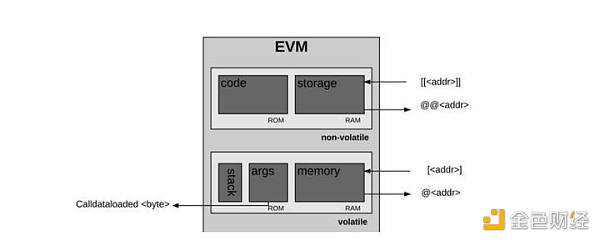        | [EVM storage structure](https://coinyuppie.com/in-depth-understanding-of-evm-storage-mechanism-and-security-issues/) |
| 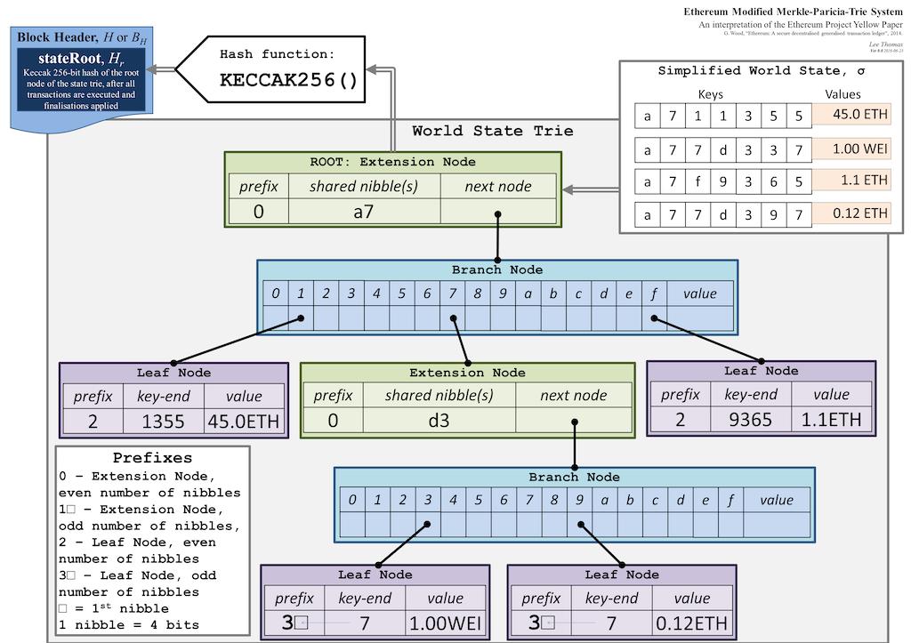        | [Ethereum state trie](https://ethereum.stackexchange.com/questions/268/ethereum-block-architecture) |
| 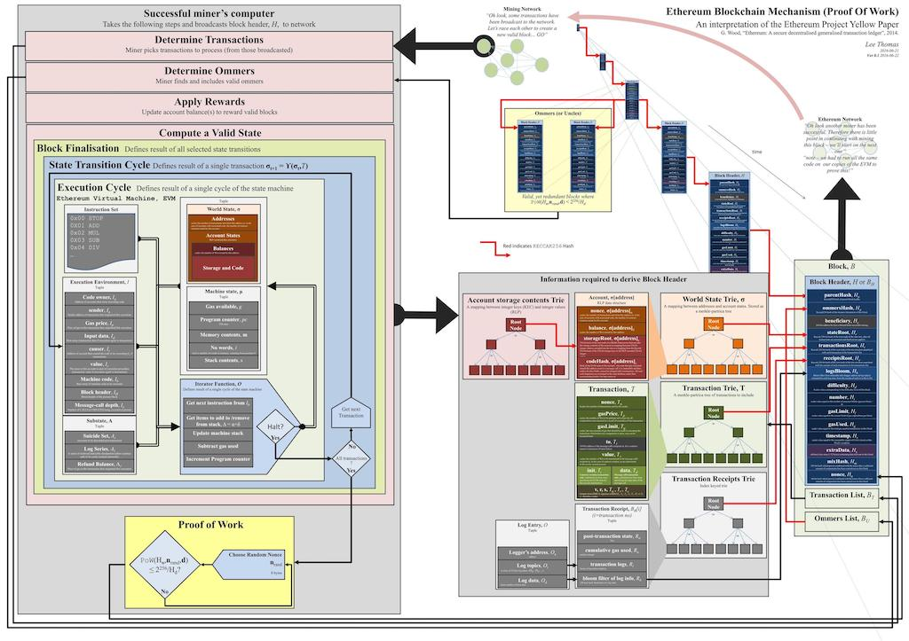        | [Ethereum blockchain mechanism](https://ethereum.stackexchange.com/questions/268/ethereum-block-architecture) |
| 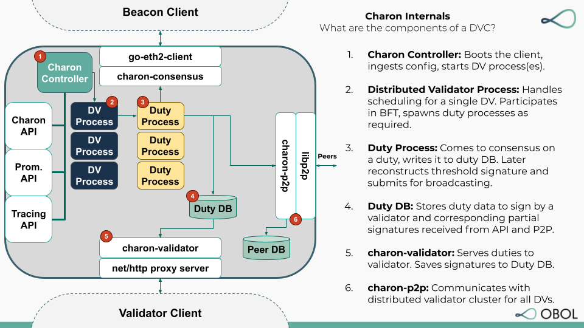        | [Distributed Ethereum validator](https://docs.obol.tech/docs/dv/introducing-charon) |
| 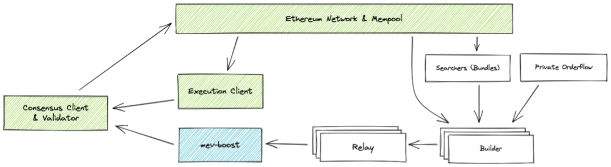        | [MEV Boost](https://www.blocknative.com/blog/ethereum-block-building) |

## L2

| Diagram                                                | Source                                                   |       
| -------                                                | ------                                                   | 
|         | [Layer 2 solutions](https://cryptoshine.medium.com/understanding-zero-knowledge-layer-2-scaling-2b88edd86016)                                                          |
|         | [Optimism high level architecture](https://community.optimism.io/docs/protocol/protocol-2.0/#)                                                                           |
|         | [ZKSync high level architecture](https://starli.medium.com/l2-deep-into-zksync-source-code-d6be1b3c16e5)                                                                   |
|         | [StarkNet high level roadmap](https://medium.comstarkwareon-the-road-to-starknet-a-permissionless-stark-powered-l2-zk-rollup-83be53640880)                       |
|         | [Connext is the interoperability protocol of L2 Ethereum](https://nxtp-docs.connext.network/Integration/SystemOverview/howitworks)                                  |
|         | [Celestium as the data availability layer](https://blog.celestia.org/celestiums/)         |
| 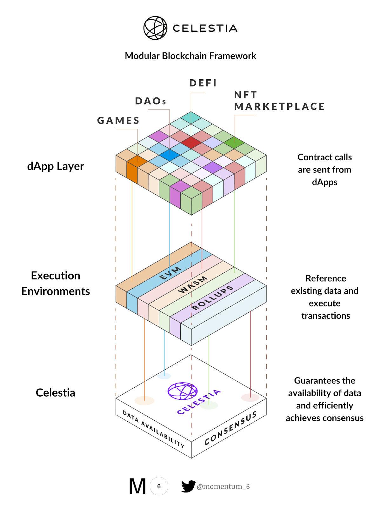        | [Celestia - modular blockchain](https://medium.com/momentum6/modular-blockchains-the-next-alpha-celestia-overview-456ca5bbf9b1)                         |
| 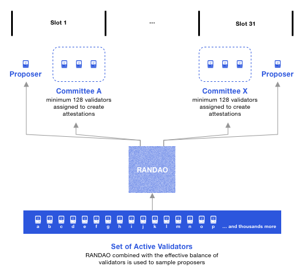        | [RANDAO selects proposers for each slot, and shuffles validators to committees](https://ethos.dev/beacon-chain/)                                  |
| 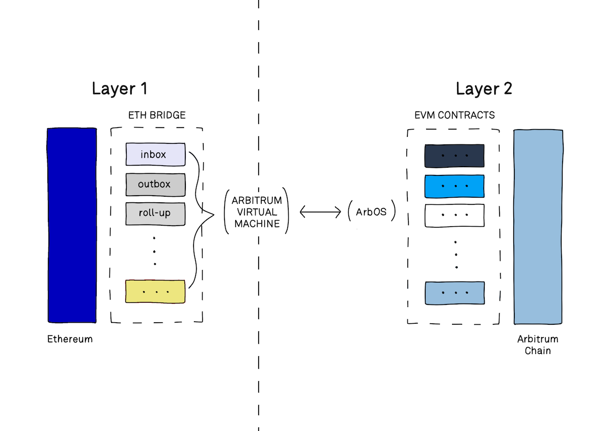        | [Arbitrum high level architecture](https://tracer.finance/radar/arbitrum-in-under-10/)                                        |
| 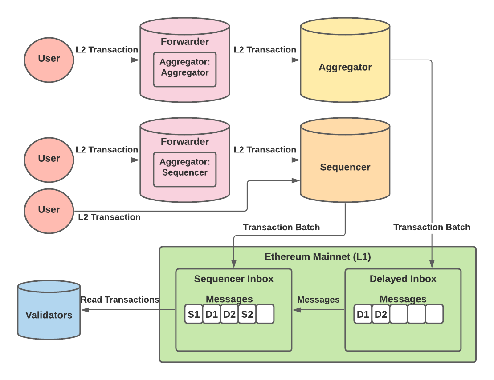        | [Arbitrum transaction paths](https://medium.com/privacy-scaling-explorations/a-technical-introduction-to-arbitrums-optimistic-rollup-860955ea5fec)                               |
|         | [Polygon architecture](https://docs.polygon.technology/docs/validate/validator/architecture/)                               |
| 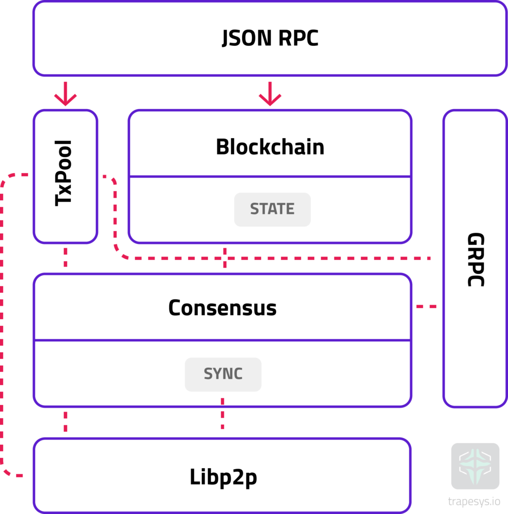        | [Polygon edge](https://blog.polygon.technology/how-to-bootstrap-a-blockchain-with-polygon-edge/?utm_source=Twitter-Main&utm_medium=Tweet&utm_campaign=Tier-1-Announcement)                               |
| 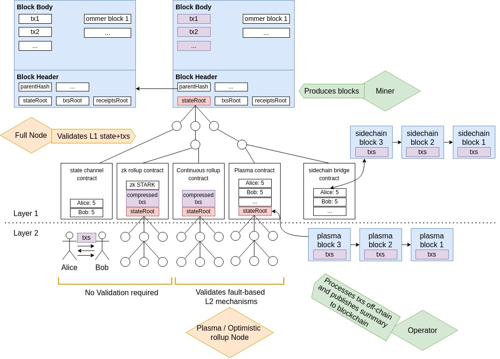        | [Ethereum scaling solutions](https://samlaf.github.io/blockchain/graphical-depiction-of-ethereum-scaling-solutions.html) |
|         | [Polygon zkEvm](https://blog.polygon.technology/the-future-is-now-for-ethereum-scaling-introducing-polygon-zkevm/) |

## Oracles
| Diagram                                                | Source                                                   |       
| -------                                                | ------                                                   | 
|         | [UMA's DVM Oracle](https://docs.umaproject.org/oracle/tech-architecture)                                                          |
|         | [Chainlink Oracle](https://www.kaleido.io/blockchain-blog/how-chainlink-works-under-the-covers)                                                          |
| 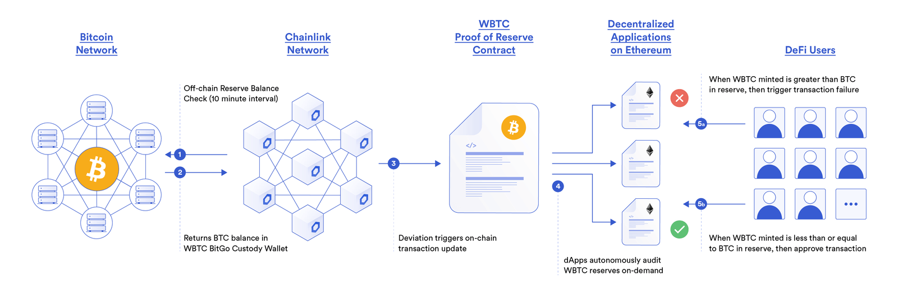        | [Chainlink Proof Of Reserves](https://blog.chain.link/proof-of-reserves/)                                               |

## Frameworks
| Diagram                                                | Source                                                   |       
| -------                                                | ------                                                   | 
| 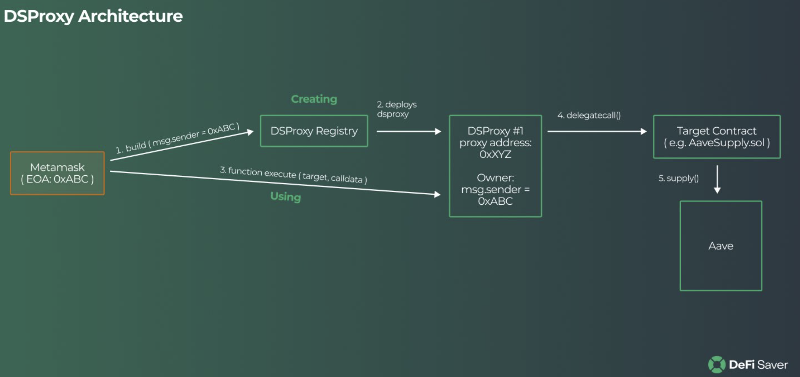        | [DS Proxy](https://twitter.com/definikola/status/1512100163527090193)                                                          |
| 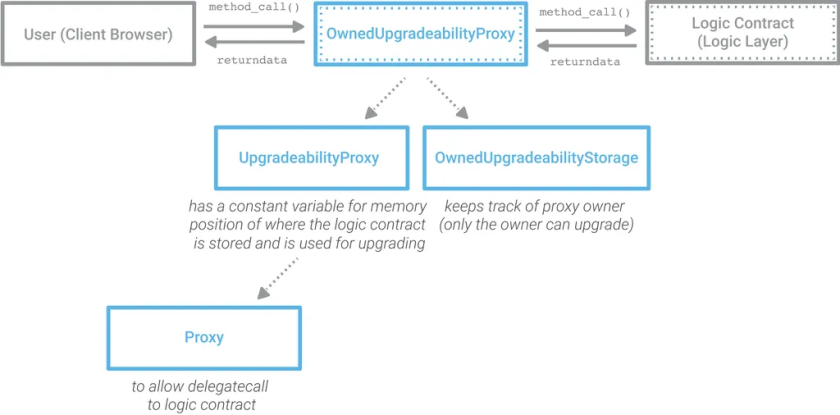        | [Unstructured Storage Proxy](https://blog.openzeppelin.com/proxy-patterns/)                                                          |

## DeFi and DAO tokenomics

| Diagram                                                | Source                                                   |       
| -------                                                | ------                                                   | 
|         | [Uniswap Constant Product Function: x * y = k](https://www.bsc.news/post/uniswap-project-insight-a-pioneer-in-the-decentralised-amm-space)                                                   |
|         | [Uniswap](https://docs.uniswap.org/protocol/V2/concepts/protocol-overview/how-uniswap-works)                                                   |
|         | [Uniswap Liquidity Provider](https://docs.uniswap.org/protocol/V2/concepts/protocol-overview/how-uniswap-works)                                                   |
|         | [Uniswap Trader](https://docs.uniswap.org/protocol/V2/concepts/protocol-overview/how-uniswap-works)                                                   |
|         | [Uniswap DAI to USDC swap v1](https://uniswap.org/blog/uniswap-v2)                                                   |
|         | [Uniswap DAI to USDC swap v2](https://uniswap.org/blog/uniswap-v2)                                                   |
|         | [Uniswap stored TWAP price](https://uniswap.org/blog/uniswap-v2)                                                   |
|         | [Uniswap price from TWAP](https://uniswap.org/blog/uniswap-v2)                                                   |
|         | [Uniswap flash swap](https://uniswap.org/blog/uniswap-v2)                                                   |
|         | [Curve Finance](https://medium.com/stakecapital/curve-tokenomics-and-first-mover-advantage-54f2143728c2)                                                   |
|         | [Aave](https://docs.aave.com/aavenomics/ecosystem-overview)                                                   |
|         | [Maker protocol smart contract modules system](https://docs.makerdao.com/)                                                   |
|         | [Tokemak reactor structure](https://coinlive.me/is-tokenak-toke-a-potential-liquidity-solution-9042.html)                                                   |
|         | [FEI pcv reweights](https://medium.com/fei-protocol/introducing-fei-protocol-2db79bd7a82b)                                                   |
|         | [FEI bonding curve](https://medium.com/fei-protocol/introducing-fei-protocol-2db79bd7a82b)                                                   |
|         | [FEI arbitrage](https://medium.com/fei-protocol/introducing-fei-protocol-2db79bd7a82b)                                                   |
|         | [FEI incentivized exchange](https://medium.com/fei-protocol/introducing-fei-protocol-2db79bd7a82b)                                                   |
|         | [FEI peg dynamics](https://medium.com/fei-protocol/introducing-fei-protocol-2db79bd7a82b)                                                   |
|        | [Yearn v2 architecture](https://defi-diagrams.herokuapp.com/yearn-vaults-v2/)                                                   |
|        | [Liquidity as a service with ondo and fei](https://medium.com/fei-protocol/if-you-are-part-of-a-dao-or-protocol-that-wants-to-create-liquidity-for-your-token-without-f49a01f02863)              |
|        | [Lido staking](https://blog.lido.fi/how-lido-works/)                                                   | 
|        | [Alchemix: self repaying loans](https://alchemixfi.medium.com/introducing-alchemix-9e7054de54d6)                                                     | 
|        | [Tracer DAO: Factory contracts for derivative markets](https://tracer.finance/radar/future-of-derivatives/)                                                     |
|        | [Yearn DeFi ecosystem map](https://messari.io/article/yearning-for-yearn)                                                     | 
|   | [Chainlink keepers](https://blog.chain.link/smart-contract-automation-use-cases-powered-by-chainlink-keepers/)                                           |
|   | [Chainlink keepers - Alchemix](https://blog.chain.link/smart-contract-automation-use-cases-powered-by-chainlink-keepers/)                                           |
|   | [Tokemak benefits](https://www.tokebase.org/way-of-the-pilot/)                                           |
|   | [Aave contracts overview](https://docs.aave.com/developers/v/1.0/developing-on-aave/the-protocol)                                           |
|   | [DeFi options: Dopex options flow](https://docs.dopex.io/pools/platform-flow)                                           |
|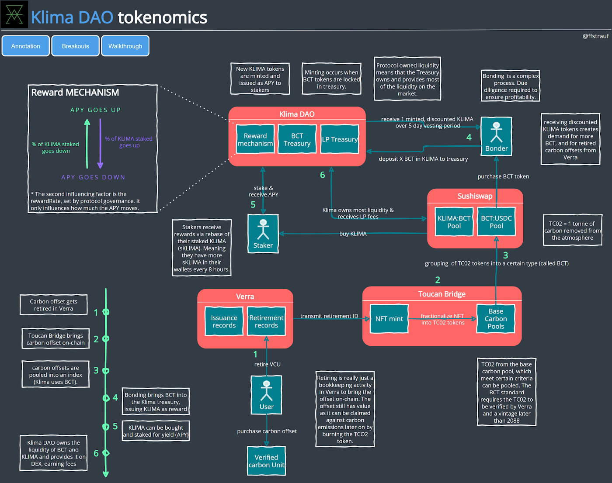   | [Tokenomics of bringing carbon on-chain and using it to back KLIMA](https://medium.com/coinmonks/tokenomics-101-klima-dao-e8fac497454f)                                           |
|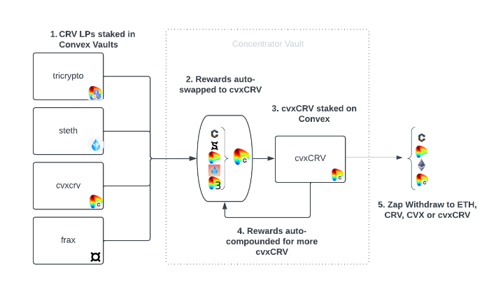   | [Aladdin Concentrator for maximazing curve LP rewards](https://curve.substack.com/p/march-11-2022-genies-out-of-the-boule?r=br6us&s=w&utm_campaign=twitter_3_11_22)                                           |
|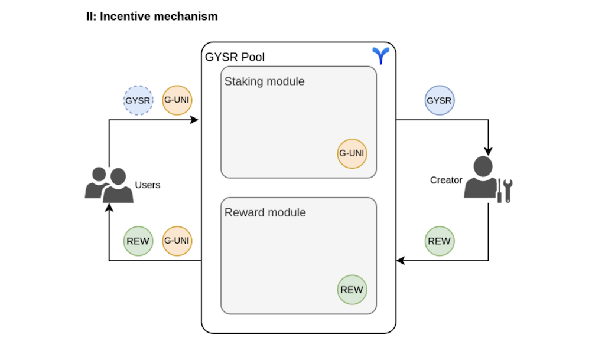   | [GYSR liquidity mining reward mechanism](https://medium.com/gysr/gysr-gelato-g-uni-for-uniswap-v3-liquidity-mining-5579c2cf8a35)             |
|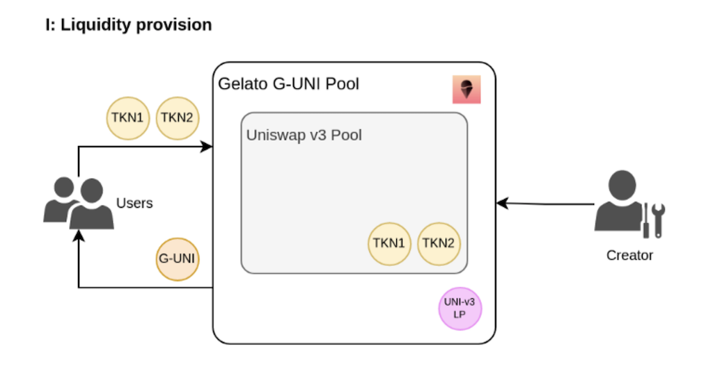   | [G-UNI Uniswap v3 liquidity management system with no code](https://medium.com/gysr/gysr-gelato-g-uni-for-uniswap-v3-liquidity-mining-5579c2cf8a35)  |
|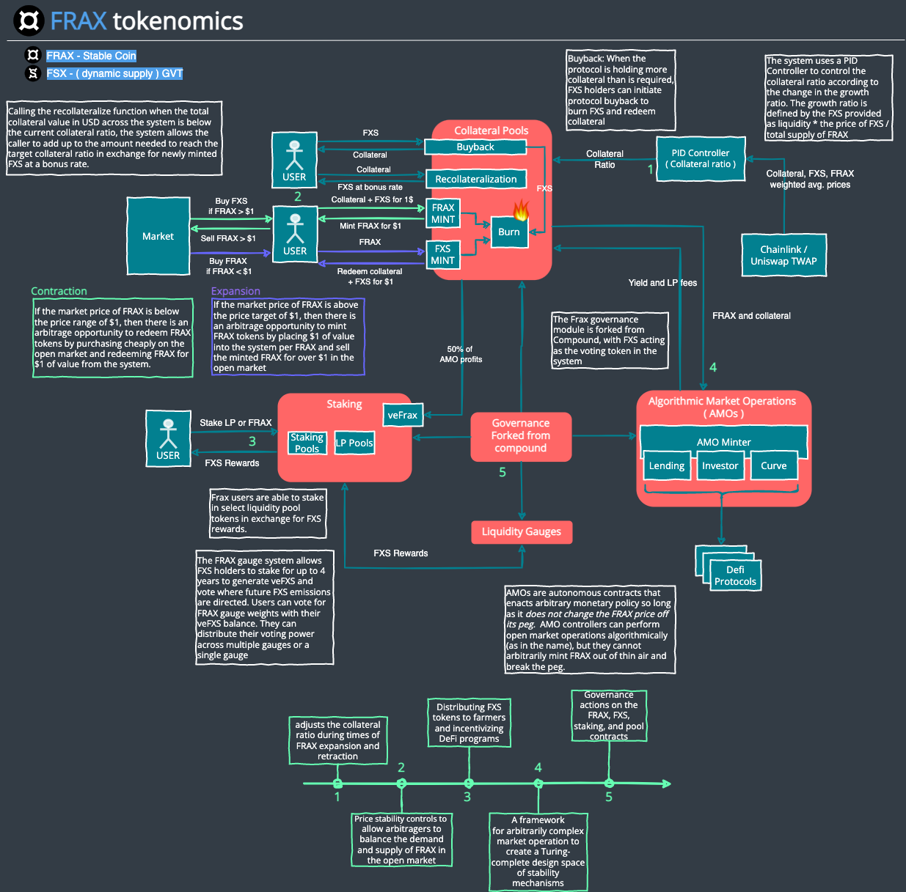   | [FRAX Tokenomics](https://tokenomicsdao.com/frax/)  |
|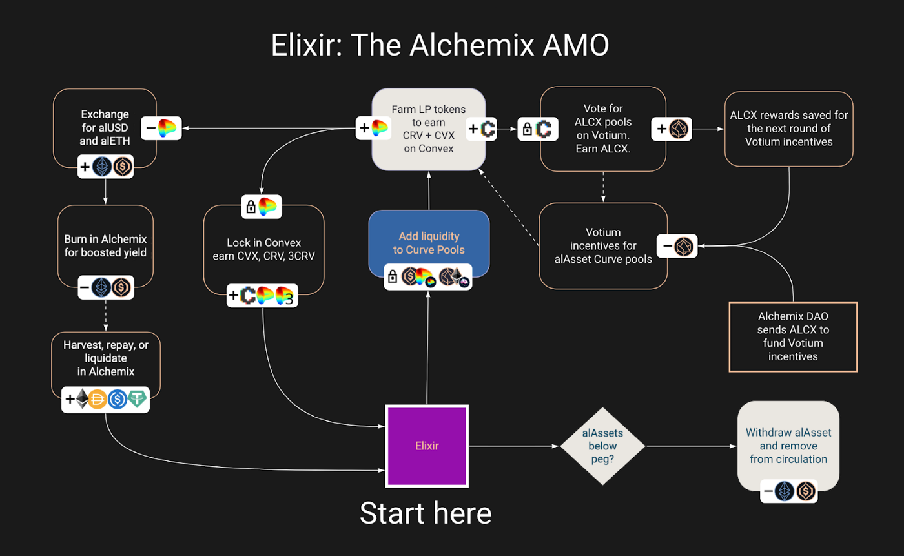   | [Alchemix Elixir](https://alchemixfi.medium.com/elixir-the-alchemix-algorithmic-market-operator-2e4c8ad04569)  |
|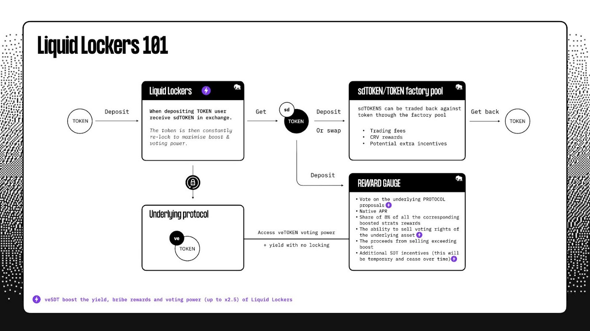   | [StakeDAO - Liquid lockers](https://stakedaohq.medium.com/introducing-liquid-lockers-vesdt-5febcf169170)  |
|   | [Lyra options AMM](https://docs.lyra.finance/implementation/lyra-protocol-architecture)  |
|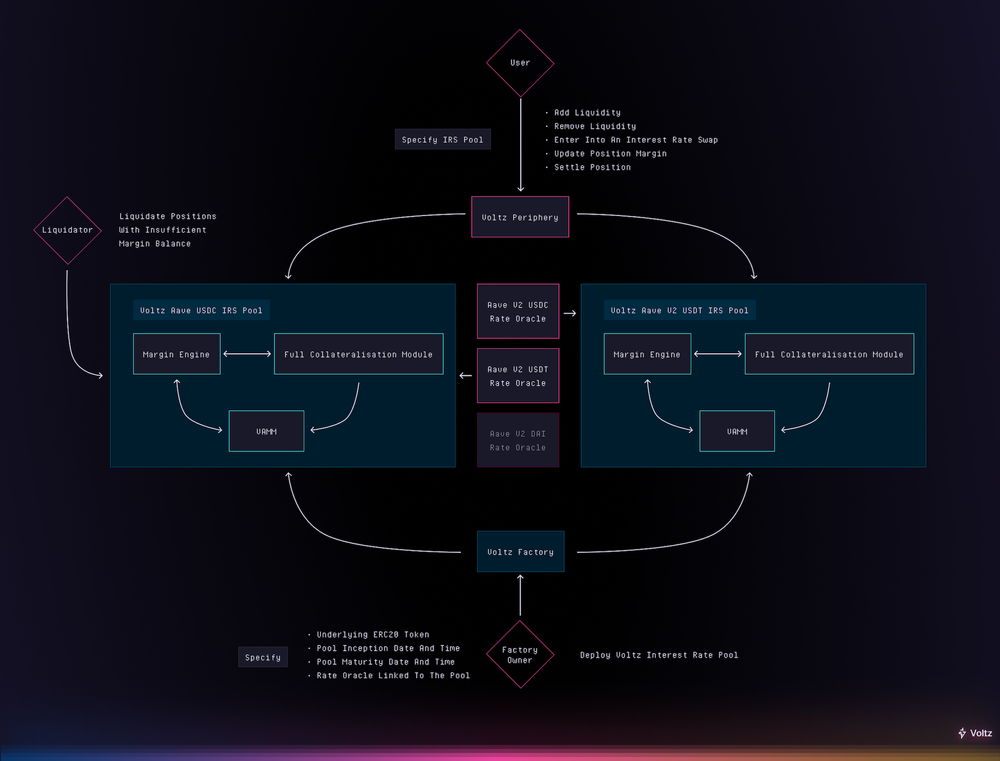   | [Voltz IRS](https://docs.voltz.xyz/getting-started/protocol-overview)  |
|   | [StarkNet Dai Bridge](https://morioh.com/p/be6c9cb57011)  |
|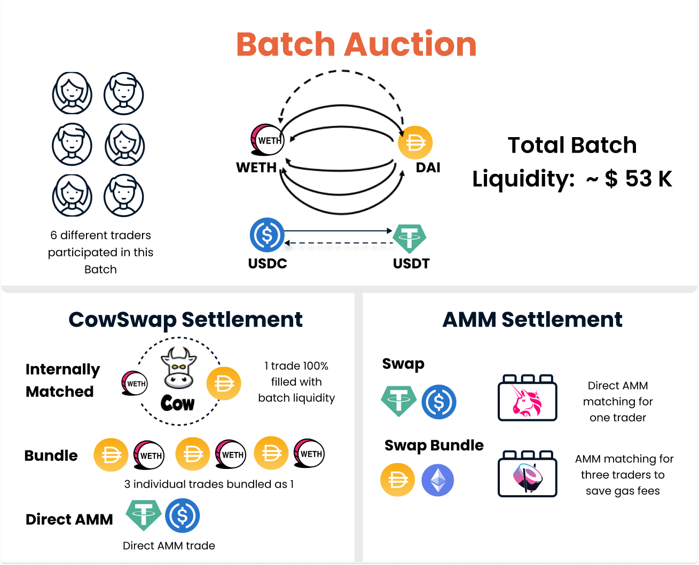   | [COW Protocol / Batch Auctions](https://docs.cow.fi/overview/batch-auctions)  |

# Governance

| Diagram                                                | Source                                                   |       
| -------                                                | ------                                                   | 
|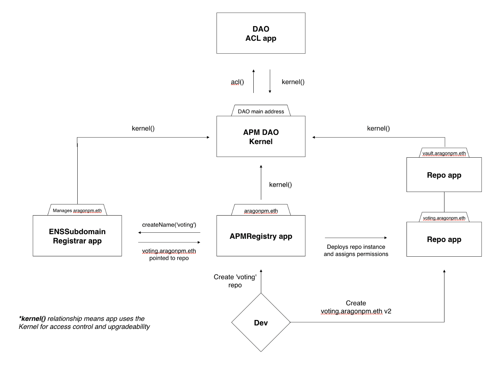   | [Building DAOs with Aragon](https://medium.com/quiknode/building-daos-with-aragon-c8b95956a405)  |

# NFT platforms

| Diagram                                                | Source                                                   |       
| -------                                                | ------                                                   | 
|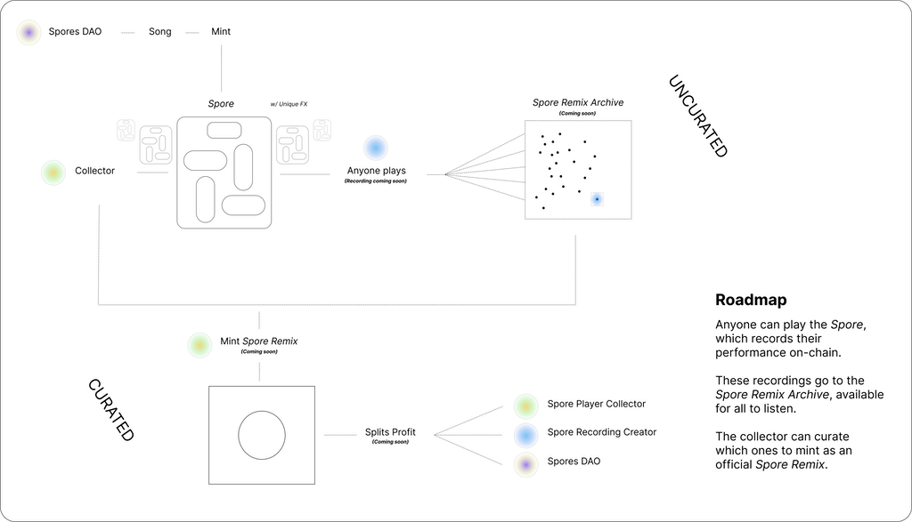   | [Spore Ecosystem](https://www.spores.vision/learn/)                  |

# Other blockchain technologies

| Diagram                                                | Source                                                   |       
| -------                                                | ------                                                   | 
|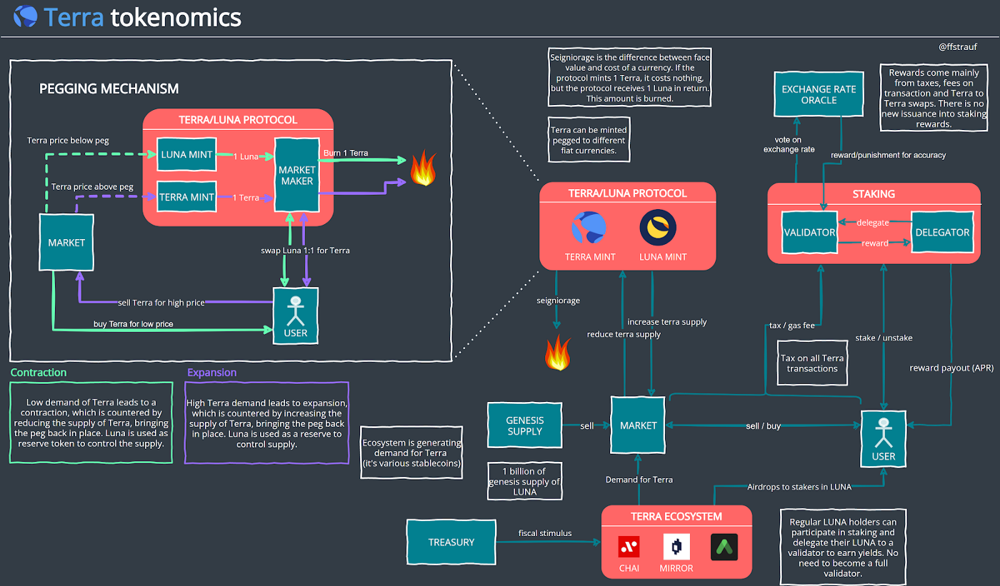   | [Terra / Luna Tokenomics](https://medium.com/bankless-dao/tokenomics-101-terra-ecosystem-cbbca4a03205)                  |
|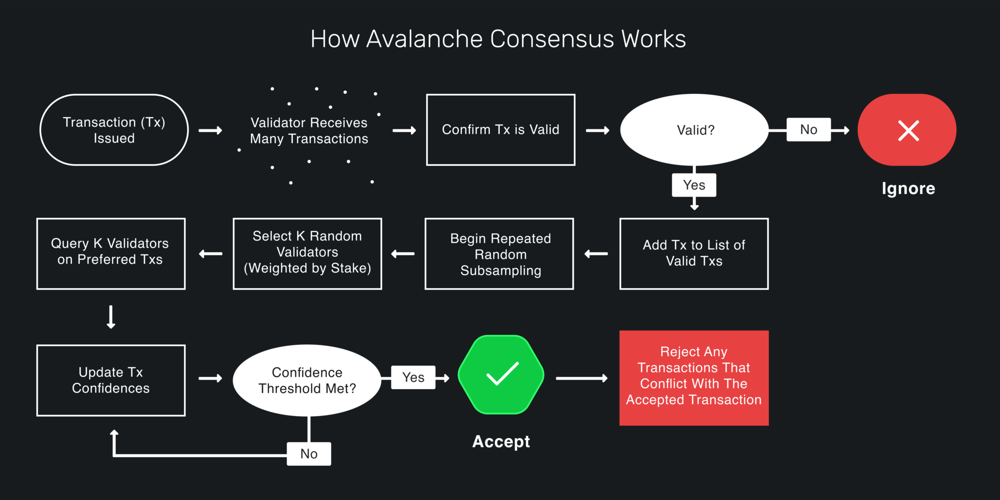   | [Avalanche Consensus](https://learn.bybit.com/altcoins/what-is-avalanche-avax/)                  |
|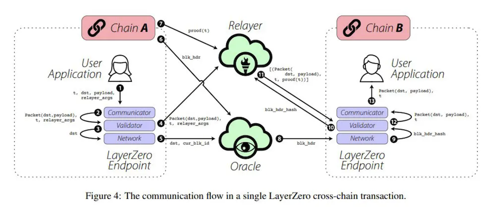   | [LayerZero](https://d-core.net/asset-review-summary-layerzero-protocol/)                  |
|   | [Spruce/Sign-in with Ethereum](https://auth0.com/blog/sign-in-with-ethereum-siwe-now-available-on-auth0/)                  |
|   | [Polygon ID](https://blog.polygon.technology/introducing-polygon-id-zero-knowledge-own-your-identity-for-web3/)                  |
|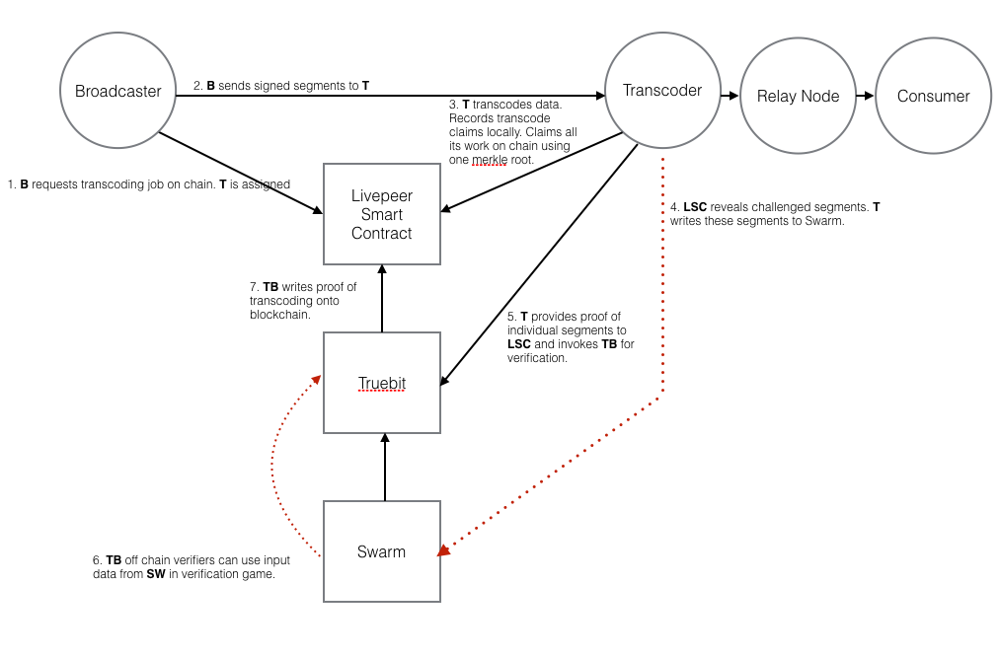   | [Livepeer](https://github.com/livepeer/wiki/blob/master/WHITEPAPER.md)                  |
|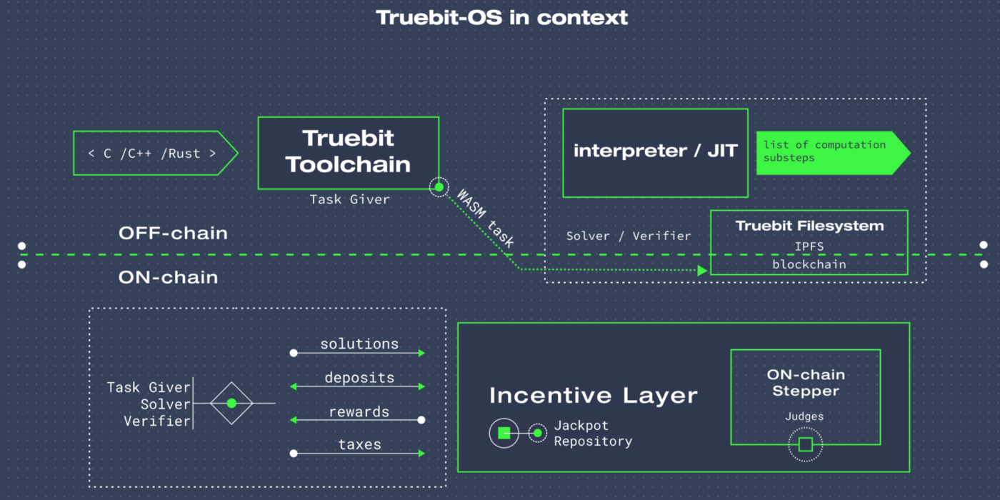   | [Truebit](https://medium.com/gasworks-crypto/truebit-the-biggest-crypto-project-youve-never-heard-of-512717e5e061)                  |
